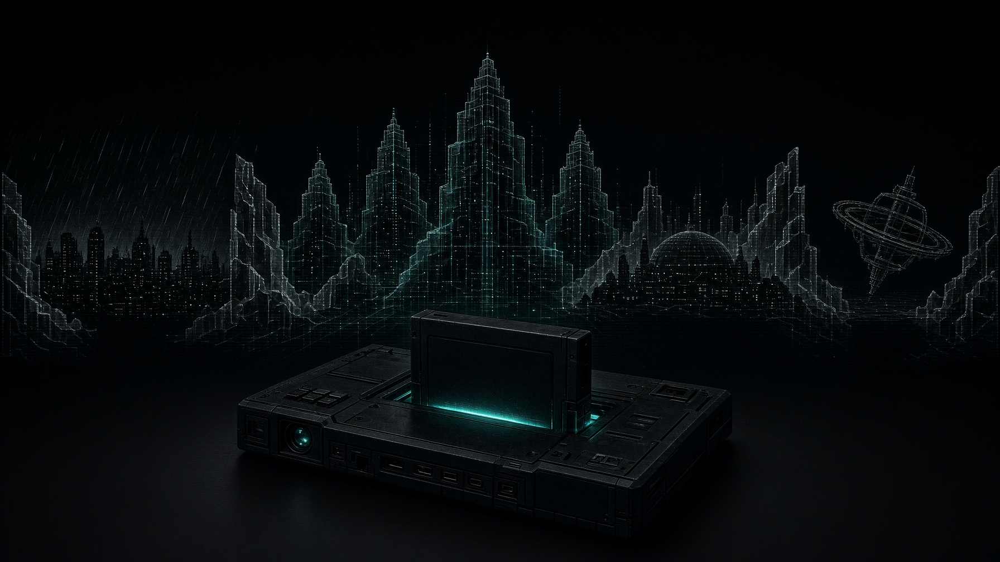

<div align="center">



# ROM // Рен

**Текстовая rogue-lite RPG по мотивам трилогии «Муравейник» Уильяма Гибсона.**
Один забег — одна загрузка конструкта и один заказ.

[](https://github.com/fgbm/rom-ren-rogue/actions/workflows/pages.yml)


**[▶ Играть в браузере](https://fgbm.github.io/rom-ren-rogue/)** · [Документация](docs/) · [Язык `.rom`](docs/rom-language.md) · [История коммитов](https://github.com/fgbm/rom-ren-rogue/commits/main)

</div>

---

> ROM-конструкт — это слепок личности, снятый с человека: форма искусственного интеллекта. Такой конструкт не учится, не имеет прав и не помнит между загрузками. Ты помнишь.

## Содержание

- [О чём](#о-чём)
- [Как это играется](#как-это-играется)
- [Возможности](#возможности)
- [Быстрый старт](#быстрый-старт)
- [Команды](#команды)
- [Язык сценариев `.rom`](#язык-сценариев-rom)
- [Структура проекта](#структура-проекта)
- [Документация](#документация)
- [Публикация](#публикация)
- [Статус](#статус)
- [Технологии](#технологии)
- [Правовой статус](#правовой-статус)

## О чём

Ты — `ROM`-конструкт умершего ковбоя. Носитель принадлежит Ландо Виейре, и заказчика выбирает он, а не ты. Каждый забег — одна загрузка: Виейра вставляет носитель в деку, ты просыпаешься, выполняешь заказ и выгружаешься. Смерть в забеге — это выгрузка: конструкт не умирает, он выключается.

По канону конструкт не должен помнить между загрузками. То, что Рен помнит, и есть игра.

Мир — спустя годы после «Нейроманта». Уинтермьют и Нейромант слились и снова распались; по сети бродят фрагменты распавшегося разума — ковбои зовут их «голосами», Тьюринг зовёт «остатками» и охотится за ними. Три места: Тиба-Ниндзэй, Муравейник (Бостон-Атланта) и орбитальный Фрисайд.

## Как это играется

Забег длится 10–25 минут и состоит из одного заказа:

```
Выбор заказа → Загрузка (бриф Виейры) → Стартовая локация
        → передвижение, сцены, разговоры, рейды → Развязка → Выгрузка
```

Карты на экране нет: игрок видит описание локации в текущем регистре и именованные выходы. Часть выходов требует предмет, память или флаг. По кнопке «где я была» показывается список посещённых локаций без связей.

Не менее пятой части выборов в каждом заказе ведут в тупик. Тупик — это сцена, из которой нет пути, кроме выгрузки, перехвата или необратимой потери. Игроку должно быть некомфортно — это намеренно.

### Ресурсы

Внутри забега (сгорают):

| Ресурс | Что это | На что тратится |
|---|---|---|
| **Кредит** | новые иены на счету заказчика | софт, взятки, проходы |
| **Софт** | ледоколы, маски, патчи | рейды, патрули |
| **Внимание** | насколько Тьюринг близко | при 5 — перехват, один раз за забег |
| **Целостность** | состояние носителя | при 0 — выгрузка; при 1 текст рвётся |

Между забегами (копятся):

| Ресурс | Что это |
|---|---|
| **Память** | фрагменты: свои, Ханны, чужие |
| **Досье** | что Рен знает о персонажах |
| **Репутация** | как фракции относятся к Рен |
| **Заказы** | что выполнено, а что сорвано |

Память — единственный ресурс, который у Рен нельзя отнять. Кроме Ржи: он может.

### Провал и GAME OVER

Заказ можно сорвать. Вход в сцену `[dead:refusal]` помечает забег проваленным: заказ выполнить уже нельзя, и движок сам ведёт Рен домой — до трёх переходов, каждый добавляет внимание. Когда переходы кончились, движок фиксирует след: репутация заказчика вниз, фрагмент памяти, счётчик `ordersFailed` и пометка «(сорвано)» на экране выбора.

Забег, закрытый без развязки, растит серию провалов (`meta.failStreak`) и долг владельца (`meta.debt`). При долге 3 или репутации владельца −3 Виейра продаёт носитель — это чистый GAME OVER с единственным выходом «Начать заново».

## Возможности

- **625 сцен, 31 локация, 36 заказов, 8 заказчиков, 13 предметов, 5 концовок.** За забег Рен получает 2–3 фрагмента памяти, лестница открытий растёт до порога 25 примерно к двадцатому забегу.
- **Свой язык сценариев `.rom`** — декларации заказов, локаций, сцен, выборов, условий и эффектов. Весь контент — текстовые файлы, движок о сюжете не знает.
- **Линт на этапе сборки** — ссылки, достижимость, циклы, тупики, имена говорящих, пороги памяти. Ошибка линта ломает сборку, а не показывается игроку.
- **Случайный проходчик** (`npm run simulate`) — 200 забегов, статистика покрытия и выгрузок.
- **Детерминированный аудит заказа** (`node scripts/audit.ts`) — квоты, провенанс гейтов, кандидаты soft-lock и недостижимые условия.
- **Без сервера.** Прогресс хранится в `localStorage`; статика кладётся на GitHub Pages.

## Быстрый старт

Требования: **Node.js 22+** и npm.

```bash
git clone https://github.com/fgbm/rom-ren-rogue.git
cd rom-ren-rogue
npm install
npm run dev
```

Сборка статики (для GitHub Pages base — имя репозитория):

```bash
GH_PAGES_BASE=/rom-ren-rogue/ npm run build   # результат в dist/
npm run preview
```

Отладка из консоли браузера: `game.state`, `game.goto("id_сцены")`, `game.enterLoc("id_локации")`.

## Команды

| Команда | Что делает |
|---|---|
| `npm run dev` | dev-сервер Vite; правка `content/**/*.rom` пересобирает сценарий и перезагружает страницу |
| `npm run build` | линт + `tsc --noEmit` + сборка в `dist/` |
| `npm run lint` | линт сценария, код выхода 1 при ошибках |
| `npm run stats` | таблица по заказам: сцены, выборы, доля тупиков, слова |
| `npm run graph` | `content/graph.scenes.dot` и `content/graph.locations.dot` для Graphviz |
| `npm run simulate` | случайный проходчик: 200 забегов, статистика выгрузок и покрытия |
| `node scripts/audit.ts [orderId] [--all] [--out DIR]` | детерминированный аудит заказа, markdown в stdout |

## Язык сценариев `.rom`

Весь контент лежит в `content/**/*.rom` и компилируется Vite-плагином в JSON при сборке. Файл заказа — это декларация заказа, сцены и выборы:

```text
order velt_01 client=velt "Реестр"
  requires runs >= 0
  start ninsei.coffin
  finish velt01_end
  fail velt01_fail
  done flag(velt01_sent)
  brief
    Виейра: — Ты работаешь на Вельта. Не спрашивай, кто это.
    Виейра: — Ему нужен реестр активов. Три тысячи на счету, счёт не твой.

scene velt01_raid [key] loc=ninsei.rental order=velt_01
  when !has(registry) && !flag(velt01_sold)
  Матрица раскрывается. Сетка. Зелёные кубы «Мицубиси-Дженентек» на горизонте.
  ? if has(ice_kuang)
    У тебя «Куан». Китайский. Он войдёт туда, как игла в масло.
  * Войти тихо через «Куан». [item ice_kuang] -> velt01_raid_result
      flag +clean_ice
  * Идти на старом ледоколе. Шумно. [item ice_old] -> velt01_raid_result
      attention +1
      integrity -1
  * Обойти лёд через дыру, которую ты помнишь. [memory 5] -> velt01_raid_hole
  * Не входить. Вернуться на улицу. -> @hub
```

- `order` задаёт заказчика, старт, условие `done`, развязку и (необязательно) сцену провала `fail`.
- `scene` — текст и 1–4 выбора; теги `[key]`, `[once]`, `[pool]`, `[dead:refusal]`, `[dead:unload]` управляют режиссёром.
- `? if / ? elif / ? else` — условные абзацы, `~memory`, `~item`, `~silence` — пометки о памяти, предметах и Тишине.
- Выборы несут условия (`[item ...]`, `[memory N]`, `[when ...]`) и эффекты (`flag +x`, `attention +1`, `rep velt -2`, `give registry`).

Полное описание языка — в [`docs/rom-language.md`](docs/rom-language.md), правила режиссёра — в [`docs/run-loop.md`](docs/run-loop.md).

## Структура проекта

```
content/                 сценарий на языке .rom
  registry.rom           служебные сцены, пороги памяти, предметы, персонажи
  meta.rom               загрузка, выгрузка, перехват, осыпание, стирание
  keys.rom               общие ключевые сцены
  library.rom            библиотека и пять концовок
  locations/             локации трёх городов: описания и события пула
  orders/                один файл на заказ (36)
src/
  rom/                   компилятор: парсер, выражения, линт, граф
  engine/                движок: состояние, интерпретатор, режиссёр
  ui.ts, main.ts         рендер в DOM
  assets/                арт
scripts/
  rom.ts                 CLI: lint | stats | graph | build
  simulate.ts            случайный проходчик
  audit.ts               аудит заказа
.github/workflows/
  pages.yml              сборка и деплой на GitHub Pages
docs/                    библия мира и гайды сценариста
```

## Документация

| Документ | О чём |
|---|---|
| [`docs/main.md`](docs/main.md) | основная страница и глоссарий |
| [`docs/world.md`](docs/world.md) | мир, право, тон, регистры текста |
| [`docs/characters.md`](docs/characters.md) | пятнадцать персонажей, мотивации, связи |
| [`docs/locations.md`](docs/locations.md) | граф локаций трёх городов |
| [`docs/orders.md`](docs/orders.md) | каталог заказов: восемь заказчиков, 36 заказов, лестница памяти |
| [`docs/acts-and-endings.md`](docs/acts-and-endings.md) | ключевые сцены и пять концовок |
| [`docs/run-loop.md`](docs/run-loop.md) | петля забега, ресурсы, режиссёр |
| [`docs/rom-language.md`](docs/rom-language.md) | язык `.rom` и правила линта |
| [`docs/writing-guide.md`](docs/writing-guide.md) | гид сценариста |
| [`docs/spoiler-rules.md`](docs/spoiler-rules.md) | что нельзя показывать на Главной странице |

## Публикация

`main` собирается и публикуется автоматически workflow [`.github/workflows/pages.yml`](.github/workflows/pages.yml): `npm ci` → `npm run build` с `GH_PAGES_BASE=/<имя-репозитория>/` → артефакт в GitHub Pages. Источник Pages — **GitHub Actions**.

Проверить сборку локально ровно так, как это делает CI:

```bash
GH_PAGES_BASE=/rom-ren-rogue/ npm run build
```

## Статус

Играется от начала до конца. Сейчас: 625 сцен, 31 локация, 36 заказов у восьми заказчиков, пять концовок, 58 тысяч слов прозы в одних только заказах. Игрок передвигается сам, карты на экране нет. Не менее пятой части выборов в каждом заказе ведут в тупик. У каждого заказа с отказами есть сцена провала, а провал оставляет след: репутация заказчика, память и пометка «(сорвано)».

Дальше: баланс тупиков и порогов памяти, наполнение событий пула, вычитка текста.

## Технологии

- **TypeScript** — компилятор `.rom`, движок и UI.
- **Vite 6** — dev-сервер и сборка; собственный плагин `vite-plugin-rom.ts` компилирует контент и ломает сборку при ошибке линта.
- **GitHub Actions + GitHub Pages** — CI и хостинг статики.
- Без рантайм-зависимостей: только `devDependencies`.

## Правовой статус

Неофициальный некоммерческий фан-проект по мотивам трилогии «Муравейник» Уильяма Гибсона. Права на исходный мир и персонажей принадлежат автору и правообладателям. Проект не связан с ними и не претендует на их интеллектуальную собственность.

Лицензия не выбрана: по умолчанию все права сохранены. Открытого разрешения на переиспользование кода и текста нет; для форков и обсуждений — открывайте issue.
